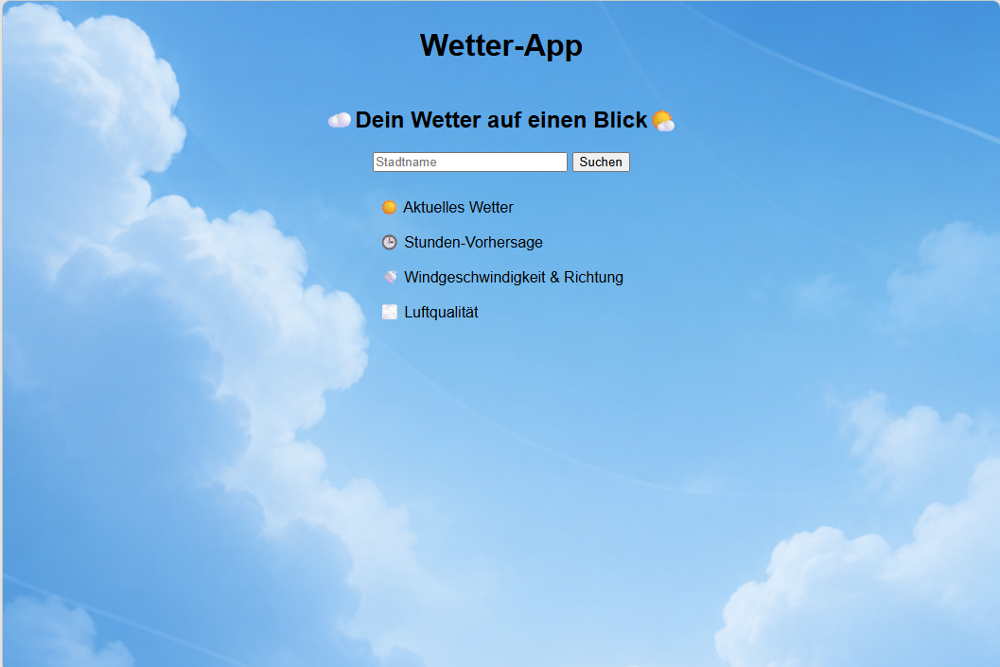
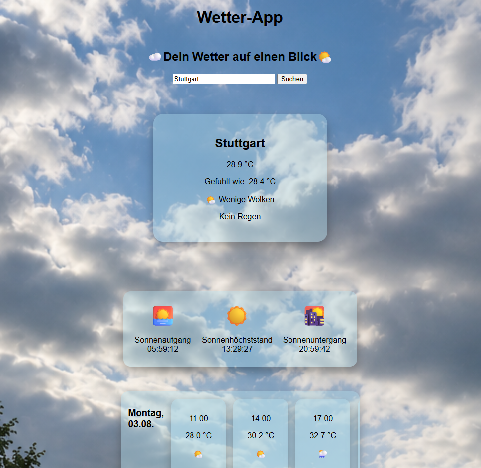
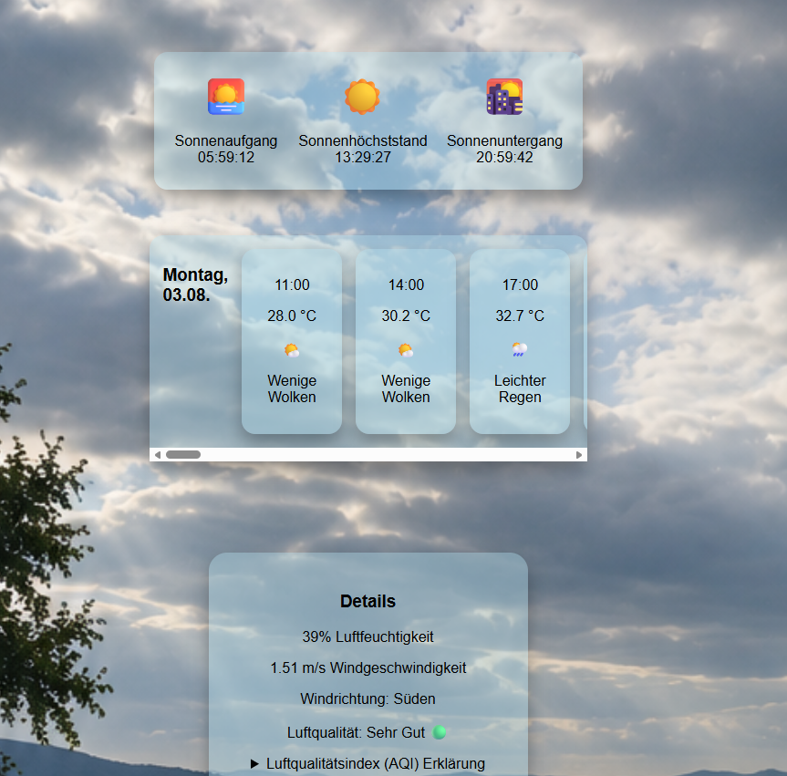
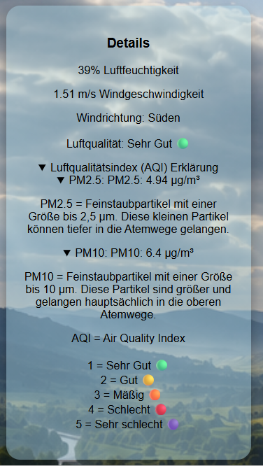
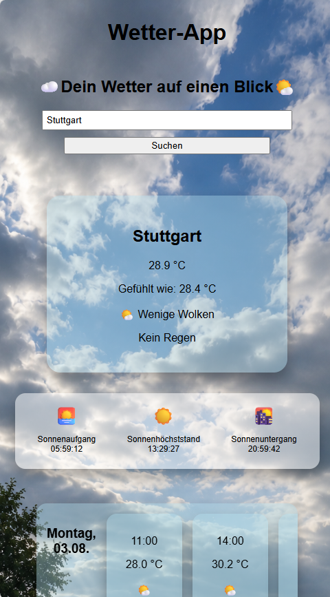
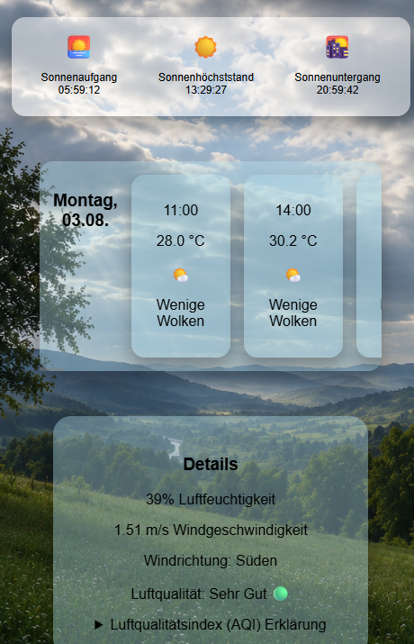

# weather-app-js
Eine Wetter-App mit JavaScript und der OpenWeather API zur Anzeige aktueller Wetterdaten und Vorhersagen verschiedener Städte mit Design für Desktop und Smartphone.
Die App erkennt die aktuelle Wetterlage und passt den Hintergrund automatisch an das Wetter an. Zusätzlich werden stündliche Wettervorhersagen, Sonneninformationen, Winddaten sowie Luftqualitätswerte angezeigt.

## Live Demo
https://weather-app-js-9phw.onrender.com/

## Screenshots
### Startseite

### Wetteranzeige nach Suche

### Luftqualität geöffnet

### Smartphone Ansicht

## Funktionen
- Suche nach Städtenamen
- Anzeige von:
  - aktueller Temperatur in °C
  - gefühlter Temperatur in °C
  - Wetterlage
  - Wetterbeschreibung
  - Regenmenge
  - Luftfeuchtigkeit
  - Windgeschwindigkeit
  - Sonnenaufgang und Sonnenuntergang
  - Sonnenhöchststand
  - Stündliche Wettervorhersage
  - Luftqualität
    - AQI (Air Quality Index)
    - PM2.5 Feinstaubwerte
    - PM10 Feinstaubwerte
    - Erklärungen
  - Windrichtung
- Übersetzung der Wetterbedingungen ins Deutsche
- Wetterabhängige Hintergrundbilder:
  - klarer Himmel
  - Wolken
  - Regen
  - Schnee
  - Gewitter
  - Nebel
- Vorschläge bei unbekannten oder falsch geschriebenen Städten
 - Suche per Enter-Taste
 - Design für Desktop und Smartphone

## Technologien
- HTML5
- CSS3
- JavaScript
- OpenWeather API

## Verwendung

1. Einen Stadtnamen eingeben.
2. Auf „Suchen“ klicken oder Enter drücken.
3. Die aktuellen Wetterdaten und Vorhersagen werden angezeigt.
